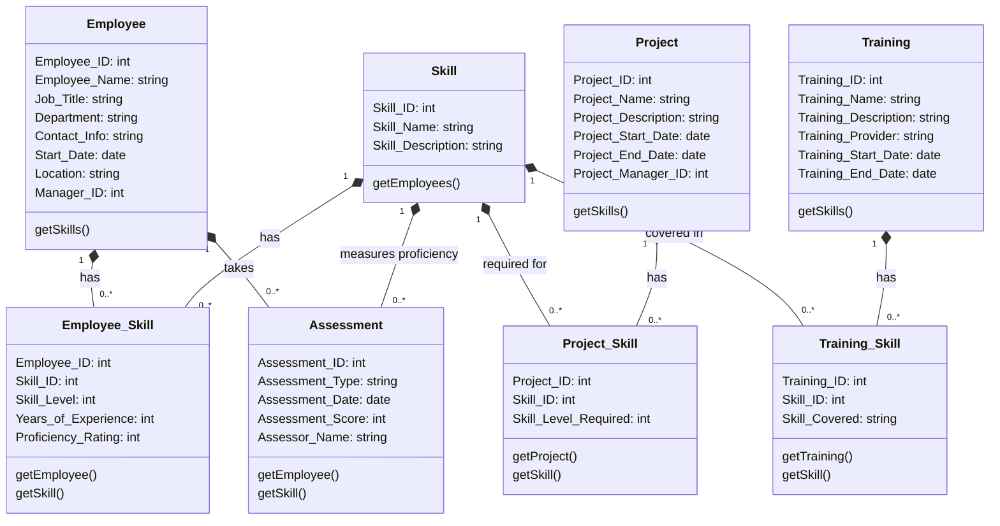

# Readme for a streamlit app to connect with Neo4j
## How to run

1. Install modules from requirements.txt
2. Add password to secrets.toml file
3. run:

```
streamlit run app.py
```

## How connections are made

1. The app connects to the Neo4j database using the password in the secrets.toml file
2. The app then queries the database for all the nodes and edges
3. The nodes and edges are then passed to a dataframe, used by the streamlit app, but any other format can be used as well


